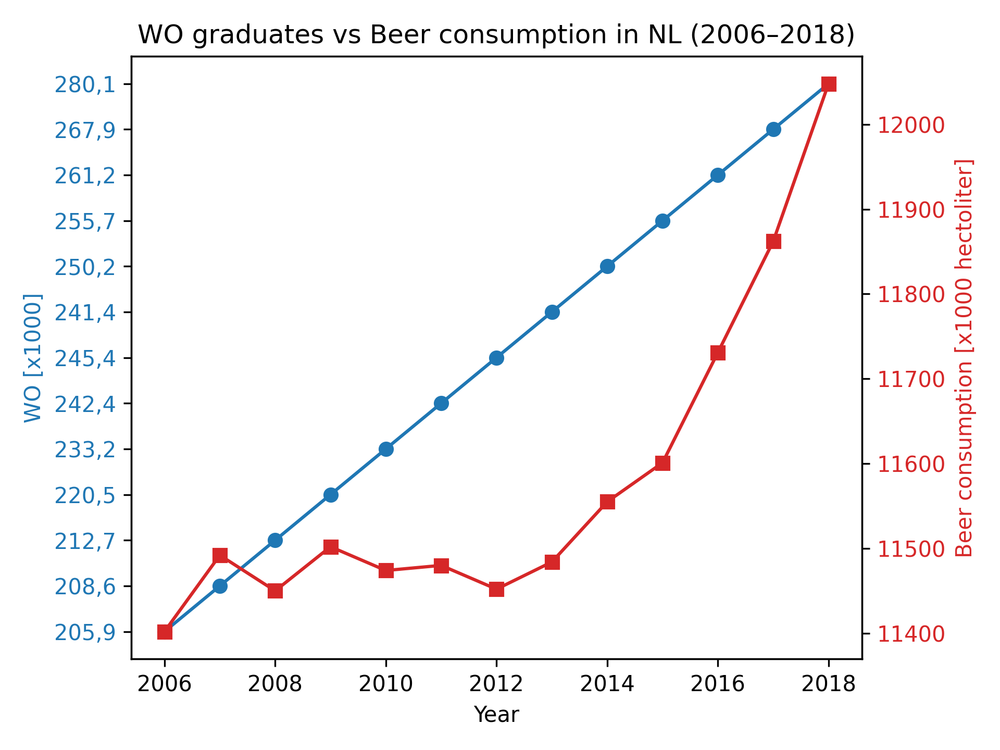

# Solution Alfonso Gondra Ostos 

# Student ID: 15843785

---

## Papers

- MCC Van Dyke et al., 2019 — *Fantastic yeasts and where to find them: the hidden diversity of dimorphic fungal pathogens*  
- JT Harvey, Applied Ergonomics, 2002 — *An Analysis of the Forces Required to Drag Sheep over Various Surfaces*  
- DW Ziegler et al., 2005 — *The neurocognitive effects of alcohol on adolescents and college students*  

---

## Visualization

## Interpretation

The graph shows two time series datasets for the Netherlands between 2006 and 2018:

- The number of university graduates (WO) is steadily increasing.
- Beer consumption remains relatively stable, with a slight upward trend in recent years.

This shows that both trends are increasing, and does not appear to have a negative relationship.

